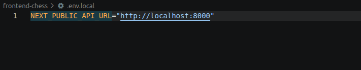
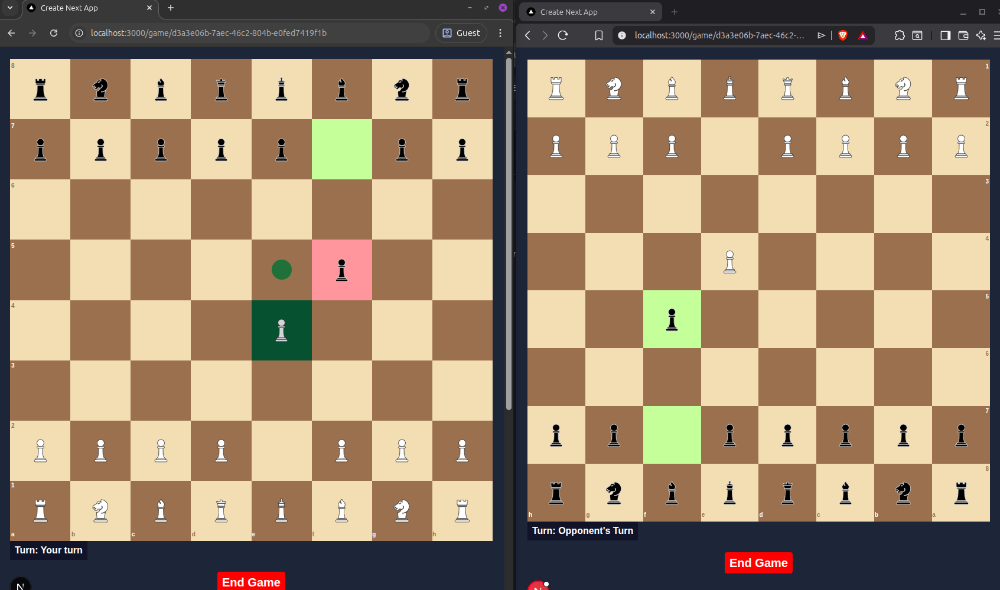
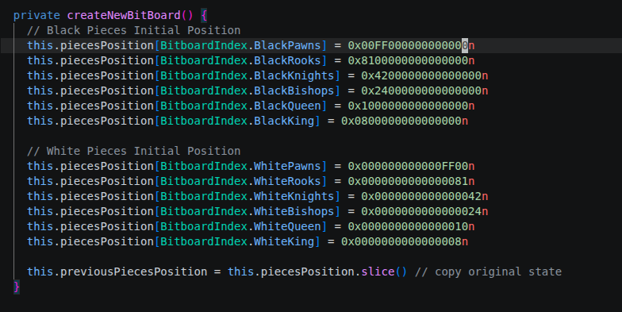

 # Multiplayer Chess Frontend

 ## How to run this Frontend Locally 

1.) First create a .env.local file in the root folder and fill it with `NEXT_PUBLIC_API_URL` (*Check [Backend Repo](https://github.com/PrabeshBimali/multiplayer-chess-backend) for setting up backend locally*) fields as shown in figure below.



2.) While in root folder in terminal run `npm install` command and wait for it to install all packages.

3.) After all packages are installed run `npm run dev` and your server should be up and running locally at `http://localhost:3000`.


For Live Demo check the URL below  
(*Note: This backend as well as Redis is run in free server so sometime it will not work or take long time to work*)

Live Preview: (https://multiplayer-chess-five.vercel.app/)

Backend URL: (https://github.com/PrabeshBimali/multiplayer-chess-backend)

&nbsp;

## Demo If Code Did NOT Run Locally


1.) As shown above, Once user opens the site there will be two buttons `Create New Game` which is for creating a multiplayer game `Play Single Player` which is for playing locally.

2.) After user clicks `Create New Game` and chooses color, a link will be provided to the user which they can share with other player to join the game.


3.) After second user joins the game, two players can play multiplayer chess as shown in figure below. Possible moves for selected piece, previous move, possible captures and turn are all shown in the UI.



4.) Games rules like **check, checkmate, en passant, castling rights** are all present in the game.  

&nbsp;

## Algorithm and Data structure used 

Since chess has 8x8 = 64 cells in total I used 8 bytes (64 bits) int to represent position of a piece as shown in the figure below. 



In above code example, initial position of Black pawn is `0x00FF000000000000n` which if we convert to bits looks like this:

`0 = 0000` and `F = 1111`

$$\begin{bmatrix}
0 &0 &0 &0 &0 &0 &0 &0 
\\\ 1 &1 &1 &1 &1 &1 &1 &1
\\\ 0 &0 &0 &0 &0 &0 &0 &0
\\\ 0 &0 &0 &0 &0 &0 &0 &0
\\\ 0 &0 &0 &0 &0 &0 &0 &0
\\\ 0 &0 &0 &0 &0 &0 &0 &0
\\\ 0 &0 &0 &0 &0 &0 &0 &0
\\\ 0 &0 &0 &0 &0 &0 &0 &0
\end{bmatrix}$$

**1** represents presence of Black pawn and **0** represents their absence. So this way we can represent all `Black` and `White` chess pieces with just twelve 8 bytes integers.

For generating move or moving pieces Bitwise operations (**OR, AND, NOT, SHIFT**) are used.

### How to move a piece
In order to move a piece move function accepts `from`, `to`, and `color`. **From** and **to** are between 0 and 63, 0 being first bit of 64 bit integer, 63 being last bit. `from` and `color` tells the function which piece to move and `to` tells where to move.

Now lets see an example how moving a **WHITE PAWN** from its initial position can be achieved.

**Initial position of all White Pawns**

In Hex: `0x000000000000FF00`

Representation in Bit: 

$$\begin{bmatrix}
0 &0 &0 &0 &0 &0 &0 &0
\\\0 &0 &0 &0 &0 &0 &0 &0 
\\\ 0 &0 &0 &0 &0 &0 &0 &0
\\\ 0 &0 &0 &0 &0 &0 &0 &0
\\\ 0 &0 &0 &0 &0 &0 &0 &0
\\\ 0 &0 &0 &0 &0 &0 &0 &0
\\\ 1 &1 &1 &1 &1 &1 &1 &1
\\\ 0 &0 &0 &0 &0 &0 &0 &0
\end{bmatrix}$$

Now lets assume user wants to move pawn at `B2` to `B3`. Which bit to move and where is highlighted below:


Piece to move: 

$$\begin{matrix}
  & A & B & C & D & E & F & G & H \\
8 & 0 & 0 & 0 & 0 & 0 & 0 & 0 & 0 \\
7 & 0 & 0 & 0 & 0 & 0 & 0 & 0 & 0 \\
6 & 0 & 0 & 0 & 0 & 0 & 0 & 0 & 0 \\
5 & 0 & 0 & 0 & 0 & 0 & 0 & 0 & 0 \\
4 & 0 & 0 & 0 & 0 & 0 & 0 & 0 & 0 \\
3 & 0 & 0 & 0 & 0 & 0 & 0 & 0 & 0 \\
2 & 1 & \color{red}{1} & 1 & 1 & 1 & 1 & 1 & 1 \\
1 & 0 & 0 & 0 & 0 & 0 & 0 & 0 & 0
\end{matrix}$$

&nbsp;

Position to move: 

$$\begin{matrix}
  & A & B & C & D & E & F & G & H \\
8 & 0 & 0 & 0 & 0 & 0 & 0 & 0 & 0 \\
7 & 0 & 0 & 0 & 0 & 0 & 0 & 0 & 0 \\
6 & 0 & 0 & 0 & 0 & 0 & 0 & 0 & 0 \\
5 & 0 & 0 & 0 & 0 & 0 & 0 & 0 & 0 \\
4 & 0 & 0 & 0 & 0 & 0 & 0 & 0 & 0 \\
3 & 0 & \color{red}{1} & 0 & 0 & 0 & 0 & 0 & 0 \\
2 & 0 & 0 & 0 & 0 & 0 & 0 & 0 & 0 \\
1 & 0 & 0 & 0 & 0 & 0 & 0 & 0 & 0
\end{matrix}$$

&nbsp;

**First remove the White Pawn at `B2` from its position**

To achieve this we do: `Position of White Pawns` **XOR** `Position of from`

```
      | 0 0 0 0 0 0 0 0 |         | 0 0 0 0 0 0 0 0 |     | 0 0 0 0 0 0 0 0 |
      | 0 0 0 0 0 0 0 0 |         | 0 0 0 0 0 0 0 0 |     | 0 0 0 0 0 0 0 0 |
      | 0 0 0 0 0 0 0 0 |         | 0 0 0 0 0 0 0 0 |     | 0 0 0 0 0 0 0 0 |
      | 0 0 0 0 0 0 0 0 |   XOR   | 0 0 0 0 0 0 0 0 |  =  | 0 0 0 0 0 0 0 0 |
      | 0 0 0 0 0 0 0 0 |         | 0 0 0 0 0 0 0 0 |     | 0 0 0 0 0 0 0 0 |
      | 0 0 0 0 0 0 0 0 |         | 0 0 0 0 0 0 0 0 |     | 0 0 0 0 0 0 0 0 |
      | 1 1 1 1 1 1 1 1 |         | 0 1 0 0 0 0 0 0 |     | 1 0 1 1 1 1 1 1 |
      | 0 0 0 0 0 0 0 0 |         | 0 0 0 0 0 0 0 0 |     | 0 0 0 0 0 0 0 0 |
```
&nbsp;

Now White Pawns Positions looks like this:

$$\begin{matrix}
  & A & B & C & D & E & F & G & H \\
8 & 0 & 0 & 0 & 0 & 0 & 0 & 0 & 0 \\
7 & 0 & 0 & 0 & 0 & 0 & 0 & 0 & 0 \\
6 & 0 & 0 & 0 & 0 & 0 & 0 & 0 & 0 \\
5 & 0 & 0 & 0 & 0 & 0 & 0 & 0 & 0 \\
4 & 0 & 0 & 0 & 0 & 0 & 0 & 0 & 0 \\
3 & 0 & 0 & 0 & 0 & 0 & 0 & 0 & 0 \\
2 & 1 & \color{red}{0} & 1 & 1 & 1 & 1 & 1 & 1 \\
1 & 0 & 0 & 0 & 0 & 0 & 0 & 0 & 0
\end{matrix}$$

&nbsp;

**Now move white pawn removed from `B2` to `B3`**

To achieve this we do: `Position of White Pawns after removal` **OR** `Position of to`

```

      | 0 0 0 0 0 0 0 0 |         | 0 0 0 0 0 0 0 0 |     | 0 0 0 0 0 0 0 0 |
      | 0 0 0 0 0 0 0 0 |         | 0 0 0 0 0 0 0 0 |     | 0 0 0 0 0 0 0 0 |
      | 0 0 0 0 0 0 0 0 |         | 0 0 0 0 0 0 0 0 |     | 0 0 0 0 0 0 0 0 |
      | 0 0 0 0 0 0 0 0 |   OR    | 0 0 0 0 0 0 0 0 |  =  | 0 0 0 0 0 0 0 0 |
      | 0 0 0 0 0 0 0 0 |         | 0 0 0 0 0 0 0 0 |     | 0 0 0 0 0 0 0 0 |
      | 0 0 0 0 0 0 0 0 |         | 0 1 0 0 0 0 0 0 |     | 0 1 0 0 0 0 0 0 |
      | 1 0 1 1 1 1 1 1 |         | 0 0 0 0 0 0 0 0 |     | 1 0 1 1 1 1 1 1 |
      | 0 0 0 0 0 0 0 0 |         | 0 0 0 0 0 0 0 0 |     | 0 0 0 0 0 0 0 0 |
```

Final Position of White Pawns after the move:

$$\begin{matrix}
  & A & B & C & D & E & F & G & H \\
8 & 0 & 0 & 0 & 0 & 0 & 0 & 0 & 0 \\
7 & 0 & 0 & 0 & 0 & 0 & 0 & 0 & 0 \\
6 & 0 & 0 & 0 & 0 & 0 & 0 & 0 & 0 \\
5 & 0 & 0 & 0 & 0 & 0 & 0 & 0 & 0 \\
4 & 0 & 0 & 0 & 0 & 0 & 0 & 0 & 0 \\
3 & 0 & \color{red}{1} & 0 & 0 & 0 & 0 & 0 & 0 \\
2 & 1 & 0 & 1 & 1 & 1 & 1 & 1 & 1 \\
1 & 0 & 0 & 0 & 0 & 0 & 0 & 0 & 0
\end{matrix}$$

&nbsp;

This way we can move position of a piece. Real implementation is much more complicated since we need to validate moves.

